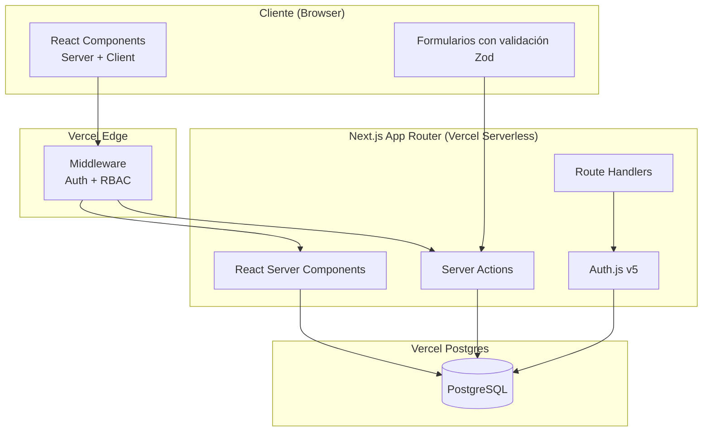
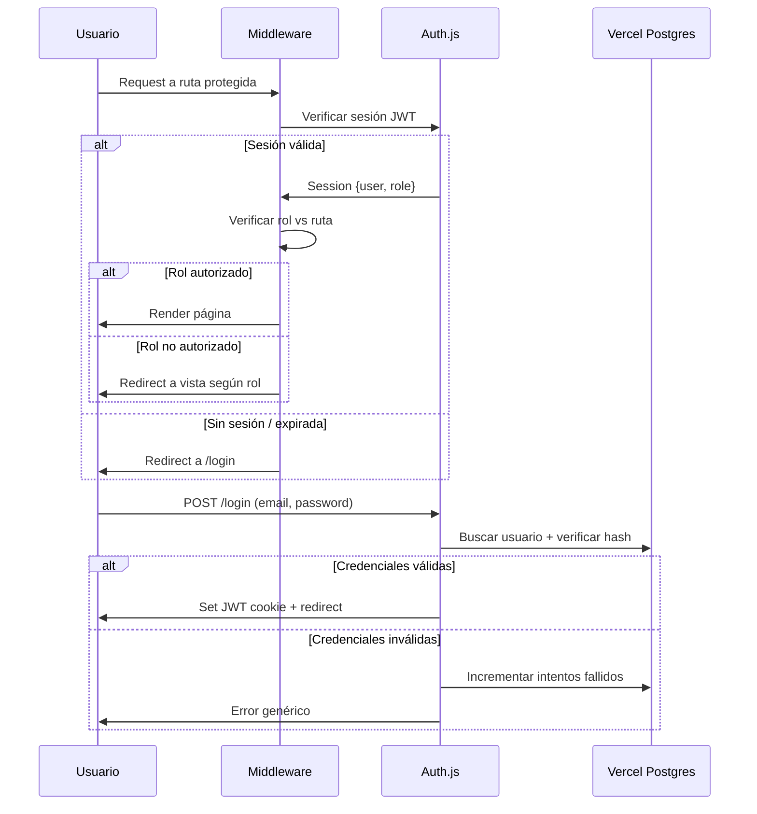
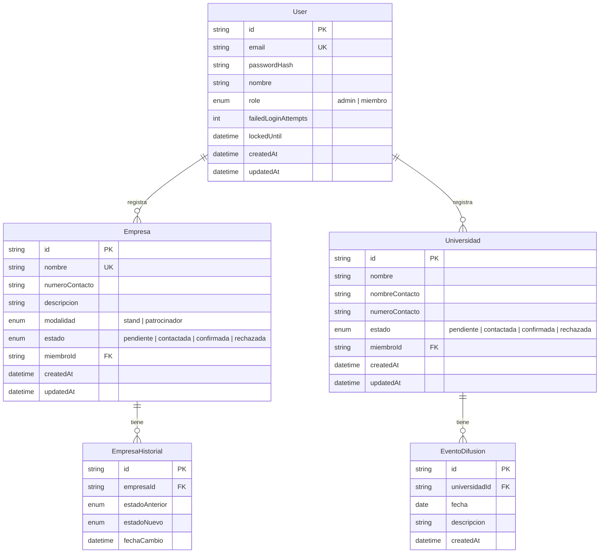
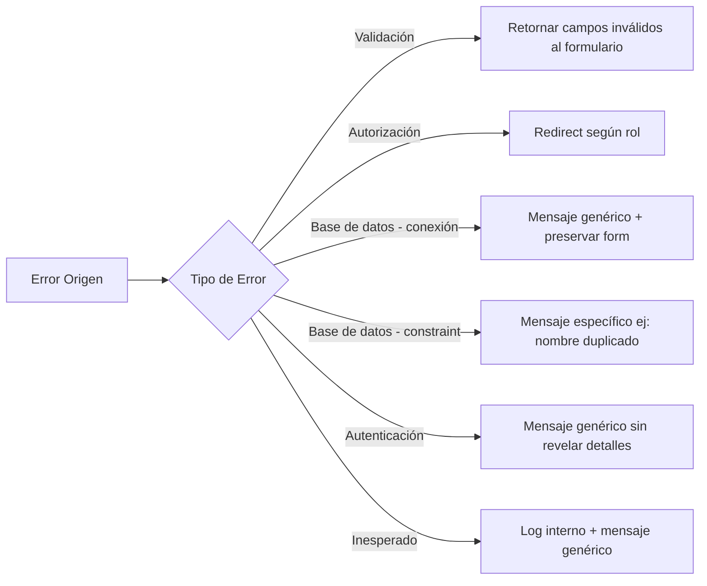

# Design Document: Nova Company Management

## Overview

Este documento describe el diseño técnico del sistema de gestión de empresas y universidades para Nova, el grupo estudiantil de la Universidad Icesi. El sistema es una aplicación web fullstack construida con Next.js (App Router) desplegada en Vercel, utilizando Vercel Postgres como base de datos y Auth.js v5 (NextAuth) para autenticación con control de acceso basado en roles.

### Decisiones Técnicas Clave

| Decisión | Elección | Justificación |
|----------|----------|---------------|
| Framework | Next.js 14+ (App Router) | Server Components por defecto, Server Actions para mutaciones, middleware para protección de rutas |
| Base de datos | Vercel Postgres | Integración nativa con Vercel, sin configuración adicional de infraestructura |
| ORM | Prisma | Tipado fuerte, migraciones declarativas, excelente soporte para Postgres en Vercel |
| Autenticación | Auth.js v5 (NextAuth) | Soporte nativo para App Router, Credentials Provider con roles, sesiones JWT |
| Estilos | Tailwind CSS | Utility-first para diseño minimalista, responsive por defecto |
| Validación | Zod | Validación de schemas en cliente y servidor, integración con TypeScript |
| Despliegue | Vercel | Zero-config para Next.js, edge functions, preview deployments |

## Architecture

### Diagrama de Arquitectura General



### Flujo de Autenticación y Autorización



### Estructura de Carpetas

```
src/
├── app/
│   ├── (auth)/
│   │   └── login/
│   │       └── page.tsx
│   ├── (dashboard)/
│   │   ├── layout.tsx
│   │   ├── dashboard/
│   │   │   └── page.tsx          # Solo Admin
│   │   ├── empresas/
│   │   │   ├── page.tsx          # Lista
│   │   │   ├── nueva/
│   │   │   │   └── page.tsx      # Formulario registro
│   │   │   └── [id]/
│   │   │       └── page.tsx      # Detalle
│   │   └── universidades/
│   │       ├── page.tsx          # Lista
│   │       ├── nueva/
│   │       │   └── page.tsx      # Formulario registro
│   │       └── [id]/
│   │           └── page.tsx      # Detalle + eventos
│   └── api/
│       └── auth/
│           └── [...nextauth]/
│               └── route.ts
├── components/
│   ├── ui/                       # Componentes base (Button, Input, Card, etc.)
│   ├── empresas/                 # Componentes específicos de empresas
│   ├── universidades/            # Componentes específicos de universidades
│   └── dashboard/                # Componentes del dashboard
├── lib/
│   ├── auth.ts                   # Configuración Auth.js
│   ├── db.ts                     # Cliente Prisma
│   ├── validations/              # Schemas Zod
│   └── utils.ts                  # Utilidades generales
├── actions/
│   ├── empresas.ts               # Server Actions para empresas
│   ├── universidades.ts          # Server Actions para universidades
│   └── auth.ts                   # Server Actions para auth
└── prisma/
    ├── schema.prisma
    └── migrations/
```

## Components and Interfaces

### Server Actions (Mutaciones)

```typescript
// actions/empresas.ts
interface CrearEmpresaInput {
  nombre: string;          // 1-100 chars, único
  numeroContacto: string;  // 7-15 dígitos
  descripcion: string;     // 1-500 chars
  modalidad: "stand" | "patrocinador";
}

interface CambiarEstadoEmpresaInput {
  empresaId: string;
  nuevoEstado: "pendiente" | "contactada" | "confirmada" | "rechazada";
}

// actions/universidades.ts
interface CrearUniversidadInput {
  nombre: string;           // 1-100 chars
  nombreContacto: string;   // 1-80 chars
  numeroContacto: string;   // 7-15 dígitos
}

interface AgendarEventoInput {
  universidadId: string;
  fecha: string;            // ISO date, debe ser futura
  descripcion: string;      // 1-300 chars
}
```

### Componentes de UI Principales

```typescript
// components/empresas/EmpresasList.tsx
interface EmpresasListProps {
  empresas: Empresa[];
  filtroModalidad?: "stand" | "patrocinador";
  filtroEstado?: EstadoEmpresa;
}

// components/empresas/EmpresaForm.tsx
interface EmpresaFormProps {
  onSubmit: (data: CrearEmpresaInput) => Promise<ActionResult>;
}

// components/empresas/EstadoBadge.tsx
interface EstadoBadgeProps {
  estado: EstadoEmpresa;  // Renderiza badge con color diferenciado
}

// components/dashboard/MemberMetrics.tsx
interface MemberMetricsProps {
  miembro: {
    nombre: string;
    totalEmpresas: number;
    empresasConfirmadas: number;
    totalUniversidades: number;
    universidadesConfirmadas: number;
  };
}

// components/dashboard/EstadoSummary.tsx
interface EstadoSummaryProps {
  resumen: Record<EstadoEmpresa, number>;
}
```

### Middleware de Autorización

```typescript
// middleware.ts
const publicRoutes = ["/login"];
const adminOnlyRoutes = ["/dashboard"];
const memberRoutes = ["/empresas", "/universidades"];

// Lógica:
// 1. Si ruta pública → pasar
// 2. Si no hay sesión → redirect /login
// 3. Si Admin accede a adminOnlyRoutes → pasar
// 4. Si Miembro accede a adminOnlyRoutes → redirect /empresas
// 5. Si cualquier rol accede a memberRoutes → pasar
```

### Schemas de Validación (Zod)

```typescript
// lib/validations/empresa.ts
const empresaSchema = z.object({
  nombre: z.string().min(1).max(100),
  numeroContacto: z.string().regex(/^\d{7,15}$/),
  descripcion: z.string().min(1).max(500),
  modalidad: z.enum(["stand", "patrocinador"]),
});

// lib/validations/universidad.ts
const universidadSchema = z.object({
  nombre: z.string().min(1).max(100),
  nombreContacto: z.string().min(1).max(80),
  numeroContacto: z.string().regex(/^\d{7,15}$/),
});

// lib/validations/evento.ts
const eventoSchema = z.object({
  fecha: z.string().refine((d) => new Date(d) > new Date(), {
    message: "La fecha debe ser futura",
  }),
  descripcion: z.string().min(1).max(300),
});
```

## Data Models

### Diagrama Entidad-Relación



### Prisma Schema

```prisma
datasource db {
  provider  = "postgresql"
  url       = env("POSTGRES_PRISMA_URL")
  directUrl = env("POSTGRES_URL_NON_POOLING")
}

generator client {
  provider = "prisma-client-js"
}

enum Role {
  admin
  miembro
}

enum Modalidad {
  stand
  patrocinador
}

enum Estado {
  pendiente
  contactada
  confirmada
  rechazada
}

model User {
  id                  String        @id @default(cuid())
  email               String        @unique
  passwordHash        String
  nombre              String
  role                Role          @default(miembro)
  failedLoginAttempts Int           @default(0)
  lockedUntil         DateTime?
  createdAt           DateTime      @default(now())
  updatedAt           DateTime      @updatedAt
  empresas            Empresa[]
  universidades       Universidad[]
}

model Empresa {
  id              String             @id @default(cuid())
  nombre          String             @unique
  numeroContacto  String
  descripcion     String
  modalidad       Modalidad
  estado          Estado             @default(pendiente)
  miembroId       String
  miembro         User               @relation(fields: [miembroId], references: [id])
  historial       EmpresaHistorial[]
  createdAt       DateTime           @default(now())
  updatedAt       DateTime           @updatedAt
}

model EmpresaHistorial {
  id             String   @id @default(cuid())
  empresaId      String
  empresa        Empresa  @relation(fields: [empresaId], references: [id])
  estadoAnterior Estado
  estadoNuevo    Estado
  fechaCambio    DateTime @default(now())
}

model Universidad {
  id              String           @id @default(cuid())
  nombre          String
  nombreContacto  String
  numeroContacto  String
  estado          Estado           @default(pendiente)
  miembroId       String
  miembro         User             @relation(fields: [miembroId], references: [id])
  eventos         EventoDifusion[]
  createdAt       DateTime         @default(now())
  updatedAt       DateTime         @updatedAt
}

model EventoDifusion {
  id             String      @id @default(cuid())
  universidadId  String
  universidad    Universidad @relation(fields: [universidadId], references: [id])
  fecha          DateTime
  descripcion    String
  createdAt      DateTime    @default(now())
}
```


## Correctness Properties

*A property is a characteristic or behavior that should hold true across all valid executions of a system — essentially, a formal statement about what the system should do. Properties serve as the bridge between human-readable specifications and machine-verifiable correctness guarantees.*

### Property 1: Entity creation initializes estado as "pendiente"

*For any* valid Empresa or Universidad input data, when the creation function is called, the resulting entity SHALL always have its estado field set to "pendiente", regardless of the input values for other fields.

**Validates: Requirements 1.1, 5.1**

### Property 2: Entity creation links to the authenticated creator

*For any* Empresa or Universidad created by any authenticated Miembro, the miembroId field of the resulting entity SHALL always equal the ID of the user who performed the creation.

**Validates: Requirements 1.4, 5.3**

### Property 3: Schema validation correctly accepts and rejects inputs

*For any* input string, the empresa/universidad validation schemas SHALL accept the input if and only if it satisfies all field constraints (nombre: 1-100 chars; numeroContacto: 7-15 digits; descripcion: 1-500 chars for empresa; nombreContacto: 1-80 chars for universidad; modalidad: exactly "stand" or "patrocinador"; evento fecha: future date; evento descripcion: 1-300 chars).

**Validates: Requirements 1.2, 1.3, 1.5, 1.7, 5.2, 5.4**

### Property 4: Validation errors identify exactly the invalid fields

*For any* combination of invalid or missing fields in a form submission, the validation error response SHALL contain one error message for each invalid/missing field and no error messages for valid fields.

**Validates: Requirements 1.6, 5.6**

### Property 5: Filtering returns only matching results

*For any* set of Empresas and any combination of Modalidad and Estado filters, all returned Empresas SHALL satisfy every active filter criterion, and no Empresa satisfying all criteria SHALL be excluded from the results.

**Validates: Requirements 2.2, 2.3, 2.4**

### Property 6: Empresa list is sorted alphabetically by name

*For any* set of Empresas returned by the list query, for every consecutive pair (empresa[i], empresa[i+1]), the nombre of empresa[i] SHALL be lexicographically less than or equal to the nombre of empresa[i+1].

**Validates: Requirements 2.1**

### Property 7: Duplicate empresa name is rejected

*For any* existing Empresa in the system and any new registration attempt with the same nombre, the system SHALL reject the creation and return a duplicate name error without creating a new record.

**Validates: Requirements 1.8**

### Property 8: Admin-only operations are denied for Miembros

*For any* user with role "miembro" and any admin-only operation (state change on Empresa, state change on Universidad, dashboard access), the system SHALL deny the operation and return an authorization error.

**Validates: Requirements 3.2, 5.8, 6.6**

### Property 9: State change creates a historial entry with correct data

*For any* Empresa or Universidad and any valid new estado different from the current one, when an Admin performs the state change, the system SHALL create exactly one historial entry recording the previous estado, new estado, and a timestamp equal to or after the time of the request.

**Validates: Requirements 3.1, 3.4, 5.10**

### Property 10: Same-state transition is a no-op

*For any* Empresa whose current estado is E, when an Admin attempts to change the estado to E (same value), the system SHALL not modify the Empresa record and SHALL not create any historial entry.

**Validates: Requirements 3.6**

### Property 11: Dashboard aggregation matches underlying data

*For any* set of Empresas and Universidades distributed among Miembros, the dashboard metrics for each Miembro SHALL equal: (a) count of their empresas, (b) count of their empresas with estado "confirmada", (c) count of their universidades, (d) count of their universidades with estado "confirmada"; and the total estado summary SHALL equal the sum of empresas grouped by each estado value.

**Validates: Requirements 4.1, 4.2, 4.3, 4.4**

### Property 12: Event scheduling requires universidad in estado "confirmada"

*For any* Universidad whose estado is NOT "confirmada" (i.e., "pendiente", "contactada", or "rechazada"), any attempt to schedule an EventoDifusion SHALL be rejected with an error indicating the universidad must be confirmed.

**Validates: Requirements 5.9**

### Property 13: Authentication redirect matches user role

*For any* successfully authenticated user, the post-login redirect destination SHALL be "/dashboard" if their role is "admin" and "/empresas" if their role is "miembro".

**Validates: Requirements 6.1**

### Property 14: Authentication error message is generic

*For any* failed login attempt (whether caused by incorrect email, incorrect password, or both), the system SHALL return the same generic error message without revealing which specific field was incorrect.

**Validates: Requirements 6.2**

### Property 15: Account locks after exactly 5 consecutive failed attempts

*For any* user account, the system SHALL lock the account (preventing login for 15 minutes) if and only if the user has accumulated exactly 5 consecutive failed login attempts. Fewer than 5 attempts SHALL NOT trigger a lock, and a successful login SHALL reset the counter to 0.

**Validates: Requirements 6.3**

### Property 16: Database error responses are sanitized

*For any* database error that propagates to the user-facing response, the error message shown to the user SHALL NOT contain server hostnames, connection strings, credentials, SQL queries, or stack traces.

**Validates: Requirements 8.3**

## Error Handling

### Estrategia General

El sistema emplea una estrategia de error handling por capas:



### Errores de Validación (Client + Server)

- Validación Zod se ejecuta en cliente (feedback inmediato) Y en servidor (seguridad)
- Los errores se retornan como un objeto `Record<fieldName, errorMessage[]>`
- El formulario preserva todos los datos ingresados y marca visualmente los campos con error
- Los mensajes son en español y específicos al campo

### Errores de Autenticación

- Credenciales inválidas: mensaje genérico "Correo electrónico o contraseña incorrectos"
- Cuenta bloqueada: "Tu cuenta ha sido bloqueada temporalmente. Intenta nuevamente en 15 minutos"
- Sesión expirada: redirect silencioso a `/login`

### Errores de Autorización

- Miembro accediendo a rutas Admin: redirect a `/empresas`
- Miembro intentando cambiar estado: respuesta 403 con mensaje "Solo el administrador puede modificar estados"
- Miembro intentando agendar evento en universidad no confirmada: mensaje "La universidad debe estar confirmada para agendar eventos"

### Errores de Base de Datos

- **Error de conexión**: Mostrar "El servicio no está disponible temporalmente. Por favor, intente de nuevo en unos minutos." Nunca exponer detalles técnicos.
- **Violación de constraint único (nombre empresa)**: Mostrar "El nombre de empresa ya se encuentra registrado"
- **Timeout**: Tratar como error de conexión

### Errores Inesperados

- Log completo al servidor (Vercel Logs) para debugging
- Mostrar al usuario: "Ocurrió un error inesperado. Por favor, intente de nuevo."
- Nunca exponer stack traces, nombres de servidor ni credenciales

### Preservación de Datos en Formularios

- Server Actions retornan el estado previo del formulario junto con los errores
- Se utiliza `useFormState` / `useActionState` de React para mantener estado
- Los datos del formulario persisten en el cliente hasta un submit exitoso

## Testing Strategy

### Enfoque Dual: Unit Tests + Property-Based Tests

Este proyecto utiliza un enfoque dual de testing:

1. **Property-Based Tests (fast-check)**: Verifican propiedades universales que deben cumplirse para todas las entradas válidas. Configurados con mínimo 100 iteraciones por propiedad.
2. **Unit Tests (Vitest)**: Verifican ejemplos específicos, edge cases, y puntos de integración entre componentes.

### Stack de Testing

| Herramienta | Propósito |
|-------------|-----------|
| Vitest | Test runner principal |
| fast-check | Librería de property-based testing |
| @testing-library/react | Testing de componentes React |
| MSW (Mock Service Worker) | Mock de API/DB en tests |
| Prisma (test client) | Testing de queries con DB in-memory |

### Property-Based Tests

Cada propiedad del documento de diseño se implementa como un test de fast-check:

```typescript
// Ejemplo: Property 3 - Schema validation
// Feature: nova-company-management, Property 3: Schema validation correctly accepts and rejects inputs
import { fc } from "fast-check";

describe("Empresa schema validation", () => {
  it("accepts valid inputs and rejects invalid ones", () => {
    fc.assert(
      fc.property(
        fc.record({
          nombre: fc.string({ minLength: 0, maxLength: 120 }),
          numeroContacto: fc.string({ minLength: 0, maxLength: 20 }),
          descripcion: fc.string({ minLength: 0, maxLength: 600 }),
          modalidad: fc.oneof(
            fc.constant("stand"),
            fc.constant("patrocinador"),
            fc.string()
          ),
        }),
        (input) => {
          const result = empresaSchema.safeParse(input);
          const shouldBeValid =
            input.nombre.length >= 1 && input.nombre.length <= 100 &&
            /^\d{7,15}$/.test(input.numeroContacto) &&
            input.descripcion.length >= 1 && input.descripcion.length <= 500 &&
            ["stand", "patrocinador"].includes(input.modalidad);
          expect(result.success).toBe(shouldBeValid);
        }
      ),
      { numRuns: 100 }
    );
  });
});
```

**Configuración de cada property test:**
- Mínimo 100 iteraciones (`numRuns: 100`)
- Cada test lleva un comentario referenciando la propiedad del diseño
- Formato del tag: `Feature: nova-company-management, Property {N}: {título}`

### Unit Tests

Los unit tests cubren:
- **Ejemplos específicos**: Casos concretos que demuestran comportamiento correcto (ej: login exitoso con credenciales conocidas)
- **Edge cases**: Condiciones límite (ej: lista vacía, formulario sin datos, sesión expirada)
- **Integración entre componentes**: Middleware + auth, Server Actions + DB
- **UI states**: Mensajes de error, estados vacíos, indicadores visuales

### Estructura de Tests

```
tests/
├── properties/
│   ├── validation.property.test.ts    # Properties 3, 4
│   ├── creation.property.test.ts      # Properties 1, 2, 7
│   ├── filtering.property.test.ts     # Properties 5, 6
│   ├── authorization.property.test.ts # Property 8
│   ├── state-machine.property.test.ts # Properties 9, 10
│   ├── dashboard.property.test.ts     # Property 11
│   ├── events.property.test.ts        # Property 12
│   ├── auth.property.test.ts          # Properties 13, 14, 15
│   └── errors.property.test.ts        # Property 16
├── unit/
│   ├── empresas/
│   ├── universidades/
│   ├── auth/
│   └── dashboard/
└── integration/
    ├── middleware.test.ts
    └── db-queries.test.ts
```

### Testing de E2E (Complementario)

Para validar flujos completos del usuario, se recomienda Playwright para tests E2E que cubran:
- Flujo de registro de empresa completo
- Flujo de cambio de estado por admin
- Flujo de login y protección de rutas
- Responsividad en viewport móvil

